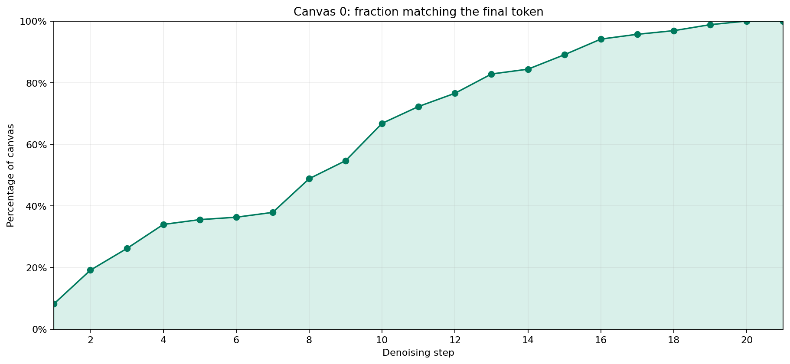
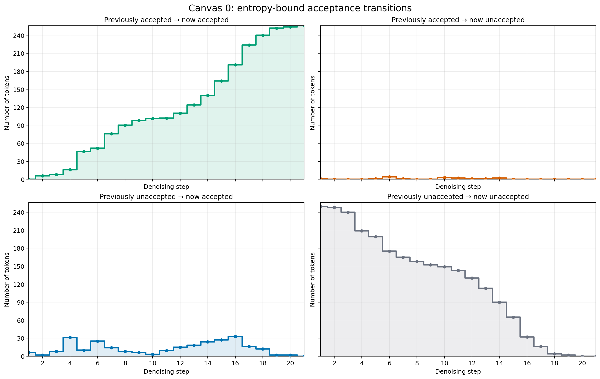

# The Annotated DiffusionGemma 

[](https://colab.research.google.com/drive/17egFGmboDkhU6duNQHvjB1J0oiKslOMl?usp=sharing)

Google recently released [DiffusionGemma](https://deepmind.google/models/gemma/diffusiongemma/), a 26B A4B open-weight uniform state diffusion language model.

We present an annotated, from-scratch implementation reimplementation that attempts to fill in the low-level details that were left out or only briefly covered in Google’s official documentation (e.g., the actual model architecture, partial RoPE, logit softcapping, Google's scalar-weight QK norm) and how exactly they are implemented (e.g., sampling, self-conditioning).

A working knowledge of vanilla autoregressive LLM implementations (Llama 3.1, MOE) is assumed.

Prompt: What is the meaning of 67?

Response:

```
The meaning of **67** depends entirely on the context in which it is used (science, mathematics, pop culture, etc.). Here are common interpretations:

### 1. Mathematics
*   **Prime Number:** 67 is a prime number, meaning it can only be divided by 1 and itself.
*   **Lucky Prime:** It is considered a "lucky prime."
*   **Sum of Primes:** It is the sum of five consecutive prime numbers.

### 2. Science and Astronomy
*   **Atomic Number:** 67 is the atomic number of **Holmium (Ho)**, a rare earth element belonging to the lanthanide series.
*   **Astronomy:** Messier object 67 (M67) is an open star cluster in the constellation of Virgo.

### 3. Culture and Slang
*   **The "67" Connection:** In the UK, "67" is a well-known drill music group from Brixton, London.
*   **Age:** In many countries, 67 is considered the standard age for full retirement eligibility or social security.

### 4. Numerology and Spirituality
*   In numerology, the number 67 is often associated with combining the energies of **6** (home, stability, and responsibility) and **7** (spirituality, intuition, and inner wisdom). It is often interpreted as a sign of building practical foundations through spiritual growth.

### 5. Other Uses
*   **Country Code:** +67 is not a complete country code, but codes starting with +67 are used in various regions (like +670 for East Timor or +679 for American Samoa).

**Is there a specific area (like a dream, a song, or a math problem) where you saw this number?** Providing more context can help me give you a more specific answer.
```

## Plots

Tokens are laid out in the canvas in reading order (left to right, top to bottom).

Per-token Entropy vs Denoising Steps ([mp4](plotting_67/canvas_00_entropy_canvas.mp4)):






More plots:
- [67](plotting_67/README.md)
- [Sudoku](plotting_sudoku/README.md)
- [Magic square](plotting_magic_square/README.md)

## Table of contents

- [Setup + Load Model](https://colab.research.google.com/drive/17egFGmboDkhU6duNQHvjB1J0oiKslOMl?usp=sharing#scrollTo=3bbb9446)
  - [Google's Scalar QK Normalization](https://colab.research.google.com/drive/17egFGmboDkhU6duNQHvjB1J0oiKslOMl?usp=sharing#scrollTo=32ad54d8)
  - [Rotary position embeddings](https://colab.research.google.com/drive/17egFGmboDkhU6duNQHvjB1J0oiKslOMl?usp=sharing#scrollTo=0a474ece)
- [Attention](https://colab.research.google.com/drive/17egFGmboDkhU6duNQHvjB1J0oiKslOMl?usp=sharing#scrollTo=7f1f6624)
  - [Gemma-specific details](https://colab.research.google.com/drive/17egFGmboDkhU6duNQHvjB1J0oiKslOMl?usp=sharing#scrollTo=1ccecfe6)
- [MOE](https://colab.research.google.com/drive/17egFGmboDkhU6duNQHvjB1J0oiKslOMl?usp=sharing#scrollTo=f7513fbc)
  - [MOE Forward](https://colab.research.google.com/drive/17egFGmboDkhU6duNQHvjB1J0oiKslOMl?usp=sharing#scrollTo=7bf0560d)
  - [Routing Score](https://colab.research.google.com/drive/17egFGmboDkhU6duNQHvjB1J0oiKslOMl?usp=sharing#scrollTo=0f17f41c)
  - [RMSNorm Fusion](https://colab.research.google.com/drive/17egFGmboDkhU6duNQHvjB1J0oiKslOMl?usp=sharing#scrollTo=b9a216f6)
- [Putting Them together](https://colab.research.google.com/drive/17egFGmboDkhU6duNQHvjB1J0oiKslOMl?usp=sharing#scrollTo=b2ad5185)
  - [Logit Softcapping](https://colab.research.google.com/drive/17egFGmboDkhU6duNQHvjB1J0oiKslOMl?usp=sharing#scrollTo=0b19ec62)
  - [Encode and Decode modes](https://colab.research.google.com/drive/17egFGmboDkhU6duNQHvjB1J0oiKslOMl?usp=sharing#scrollTo=e258af8b)
  - [Layer Scalar](https://colab.research.google.com/drive/17egFGmboDkhU6duNQHvjB1J0oiKslOMl?usp=sharing#scrollTo=b702cd2a)
- [Sampling](https://colab.research.google.com/drive/17egFGmboDkhU6duNQHvjB1J0oiKslOMl?usp=sharing#scrollTo=355920af)
  - [Lazy Sampling](https://colab.research.google.com/drive/17egFGmboDkhU6duNQHvjB1J0oiKslOMl?usp=sharing#scrollTo=948ea1c9)
  - [Stage Then Commit](https://colab.research.google.com/drive/17egFGmboDkhU6duNQHvjB1J0oiKslOMl?usp=sharing#scrollTo=ab0b3ee1)
  - [Plotting](https://colab.research.google.com/drive/17egFGmboDkhU6duNQHvjB1J0oiKslOMl?usp=sharing#scrollTo=e27873eb)
  - [Next: Tricks for speeding up diffusiongemma inference](https://colab.research.google.com/drive/17egFGmboDkhU6duNQHvjB1J0oiKslOMl?usp=sharing#scrollTo=9e4391a0)
- [References](https://colab.research.google.com/drive/17egFGmboDkhU6duNQHvjB1J0oiKslOMl?usp=sharing#scrollTo=ccde51dc)

## Findings

-- X thread --

## How to run

Easiest is [Colab](https://colab.research.google.com/drive/17egFGmboDkhU6duNQHvjB1J0oiKslOMl?usp=sharing). Locally:

```sh
uv sync
uv run --with jupyter jupyter lab main.ipynb
```

The notebook downloads the [weights](https://huggingface.co/google/diffusiongemma-26B-A4B-it) from Hugging Face and runs on CPU in bfloat16 by default. Uncomment the two lines marked "uncomment me to run on GPU" for CUDA.