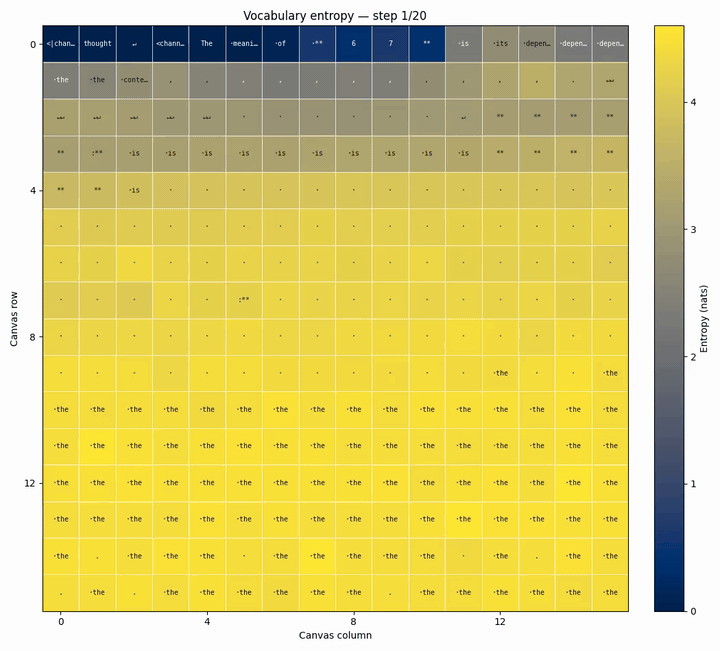

# The Annotated DiffusionGemma 

[](https://colab.research.google.com/drive/17egFGmboDkhU6duNQHvjB1J0oiKslOMl?usp=sharing)

Google recently released [DiffusionGemma](https://deepmind.google/models/gemma/diffusiongemma/), a 26B A4B open-weight uniform state diffusion language model.

We present an annotated, from-scratch implementation reimplementation that attempts to fill in the low-level details that were left out or only briefly covered in Google’s official documentation (e.g., the actual model architecture, partial RoPE, logit softcapping, Google's scalar-weight QK norm) and how exactly they are implemented (e.g., sampling, self-conditioning). We also discuss some implementation and inference ideas for DiffusionGemma: skipping computation on encode, lazy sampling, and RMSNorm fusion.

A working knowledge of vanilla autoregressive LLM implementations (Llama 3.1, MOE) is assumed.


Prompt: What is the meaning of 67?

Response (first canvas): 

```
The meaning of **67** depends entirely on the context in which it is used (science, mathematics, pop culture, etc.). Here are common interpretations:

### 1. Mathematics
*   **Prime Number:** 67 is a prime number, meaning it can only be divided by 1 and itself.
*   **Lucky Prime:** It is considered a "lucky prime."
*   **Sum of Primes:** It is the sum of five consecutive prime numbers.

### 2. Science and Astronomy
*   **Atomic Number:** 67 is the atomic number of **Holmium (Ho)**, a rare earth element belonging to the lanthanide series.
*   **Astronomy:** Messier object 67 (M67) is an open star cluster in the constellation of Virgo.

### 3. Culture and Slang
*   **The "67" Connection:** In the UK, "67" is a well-known drill music group from Brixton, London.
*   **Age:** In many countries, 67 is considered the standard age for full retirement eligibility or social security.

### 4. Numerology and Spirituality
*   In numerology, the number 67 is often associated with combining the energies of **6** (home, stability, and responsibility) and **7** (spirituality, intuition, and inner wisdom). It is often interpreted as a sign of building practical foundations through spiritual growth.

### 5. Other Uses
*   **Country Code:** +67 is not a complete country code, but codes starting with +67 are used in various regions (like +670 for East Timor or +679 for American Samoa).

**Is there a specific area (like a dream, a song, or a math problem) where you saw this number?** Providing more context can help me give you a more specific answer.
```

Per-token Entropy vs Denoising Steps ([mp4](demo.mp4)):



More plots:
- [67](plotting_67/README.md)
- [Sudoku](plotting_sudoku/README.md)
- [Magic square](plotting_magic_square/README.md)
