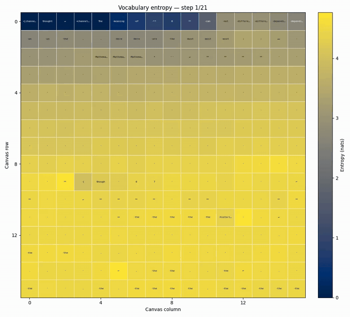
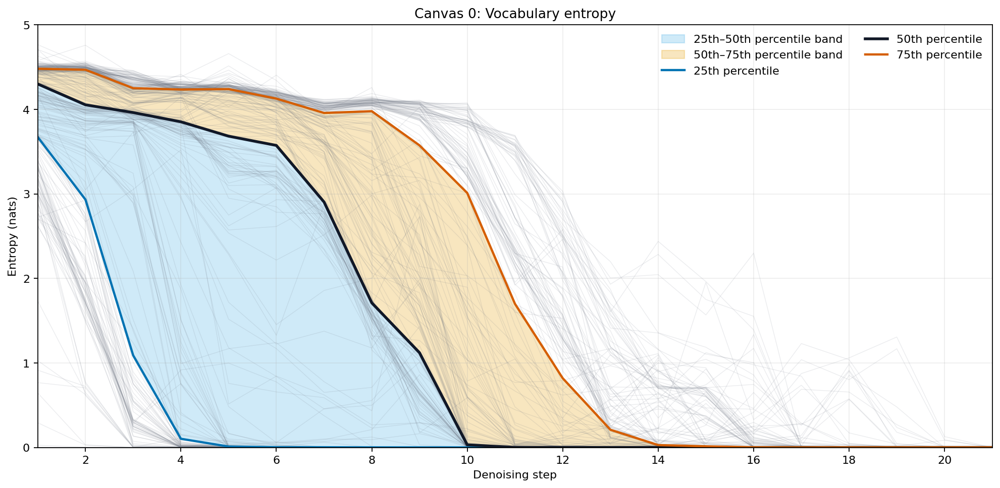
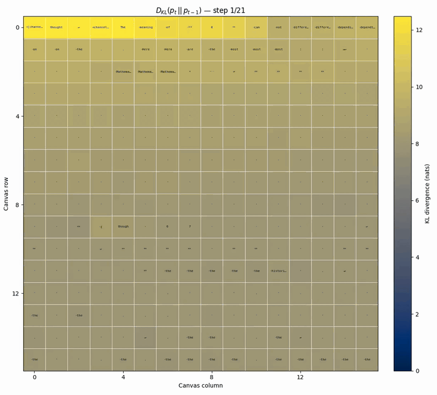
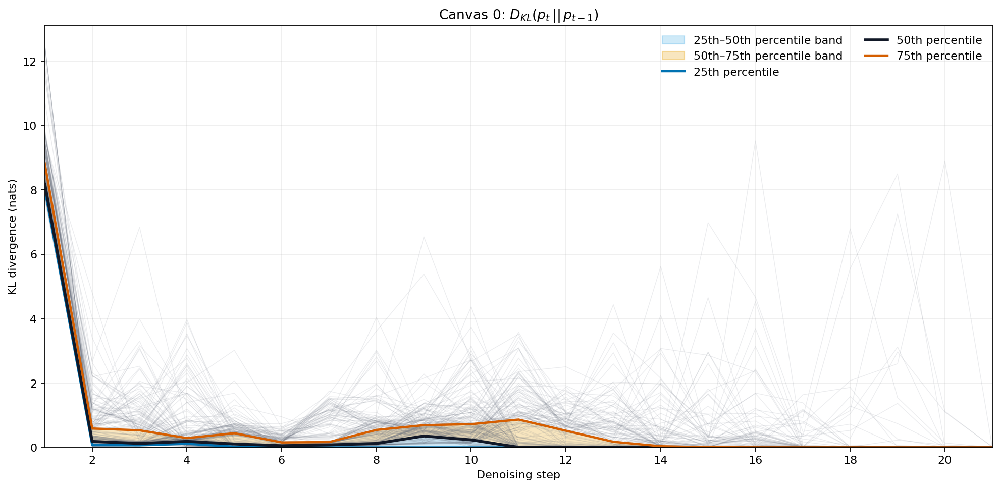
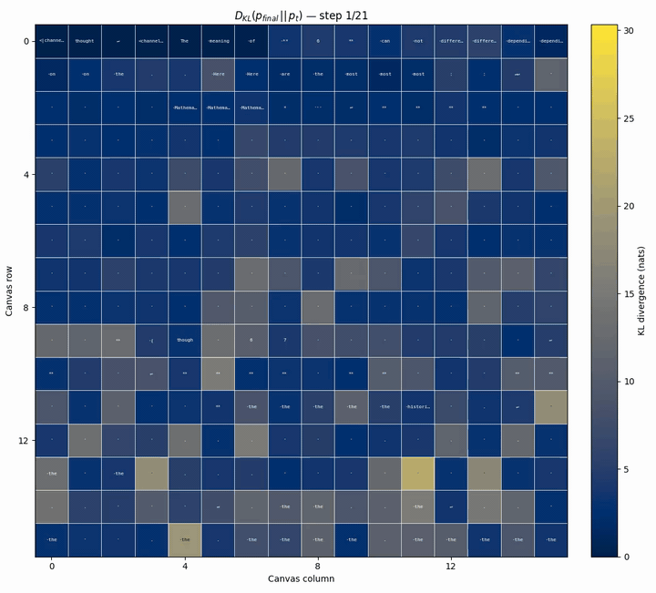
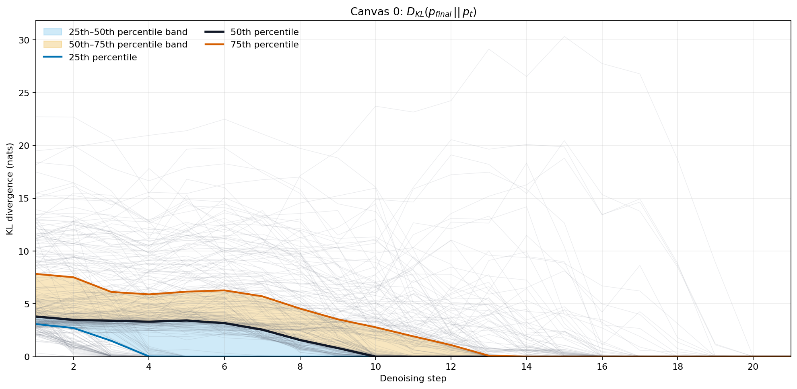
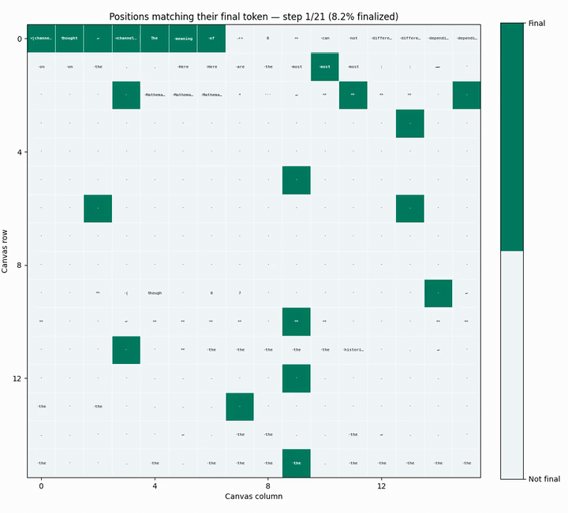
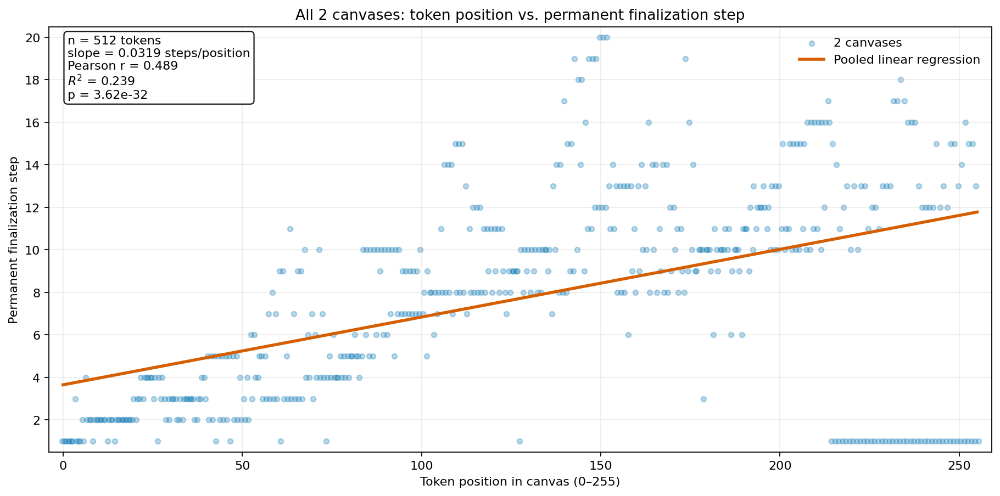

Prompt: 

```
What is the meaning of 67?
```

Model: 

```
The meaning of **67** depends entirely on the context in which it is used (science, mathematics, pop culture, etc.). Here are common interpretations:

### 1. Mathematics
*   **Prime Number:** 67 is a prime number, meaning it can only be divided by 1 and itself.
*   **Lucky Prime:** It is considered a "lucky prime."
*   **Sum of Primes:** It is the sum of five consecutive prime numbers.

### 2. Science and Astronomy
*   **Atomic Number:** 67 is the atomic number of **Holmium (Ho)**, a rare earth element belonging to the lanthanide series.
*   **Astronomy:** Messier object 67 (M67) is an open star cluster in the constellation of Virgo.

### 3. Culture and Slang
*   **The "67" Connection:** In the UK, "67" is a well-known drill music group from Brixton, London.
*   **Age:** In many countries, 67 is considered the standard age for full retirement eligibility or social security.

### 4. Numerology and Spirituality
*   In numerology, the number 67 is often associated with combining the energies of **6** (home, stability, and responsibility) and **7** (spirituality, intuition, and inner wisdom). It is often interpreted as a sign of building practical foundations through spiritual growth.

### 5. Other Uses
*   **Country Code:** +67 is not a complete country code, but codes starting with +67 are used in various regions (like +670 for East Timor or +679 for American Samoa).

**Is there a specific area (like a dream, a song, or a math problem) where you saw this number?** Providing more context can help me give you a more specific answer.
```

---

## Plots

Tokens are laid out in the canvas in reading order (left to right, top to bottom).

### Entropy (canvas)

Entropy of each position's predicted token distribution at each denoising step, with the current argmax token overlaid ([mp4](canvas_00_entropy_canvas.mp4)).



### Entropy (trajectories)

Entropy of each position's predicted token distribution across denoising steps.



### Step-to-step KL (canvas)

KL divergence $D_{KL}(p_t \,\|\, p_{t-1})$ at each denoising step — how much each position's distribution changed since the previous step ([mp4](canvas_00_kl_previous_canvas.mp4)).



### Step-to-step KL (trajectories)

KL divergence $D_{KL}(p_t \,\|\, p_{t-1})$ across denoising steps.



### KL to final (canvas)

KL divergence $D_{KL}(p_{final} \,\|\, p_t)$ at each denoising step — how far each position's distribution still is from its final one ([mp4](canvas_00_kl_final_canvas.mp4)).



### KL to final (trajectories)

KL divergence $D_{KL}(p_{final} \,\|\, p_t)$ across denoising steps.



### Finalization (canvas)

Positions whose argmax token already matches their final token, at each denoising step ([mp4](canvas_00_finalized_canvas.mp4)).



### Finalized fraction

Percentage of positions whose argmax token matches their final token, at each denoising step.


### Acceptance transitions

Number of positions in each accepted/unaccepted transition of the sampler's entropy-bound acceptance rule, at each denoising step.


### Position vs. finalization step

Each token's canvas position against the step where it permanently settles on its final token, pooled across all canvases with a linear regression.


