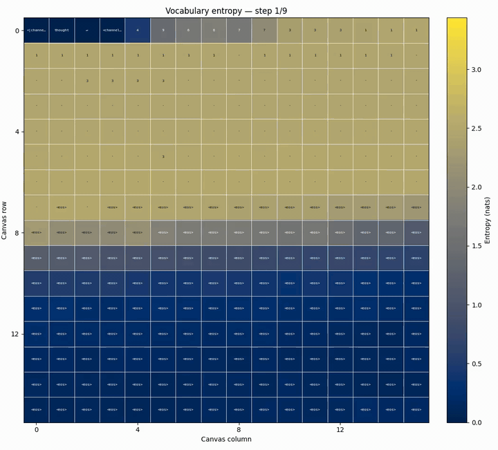
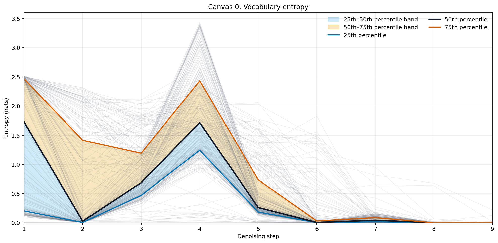
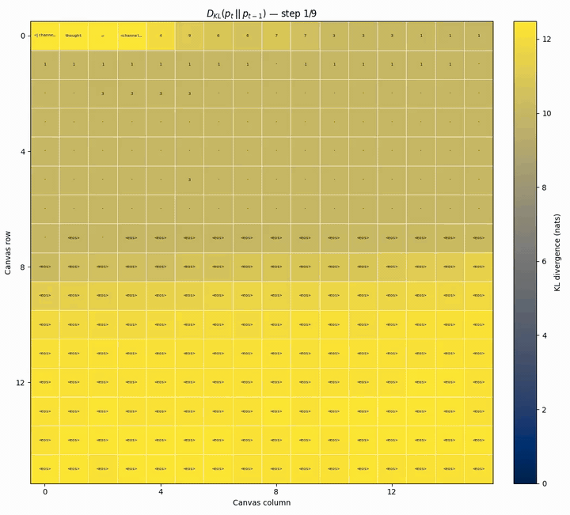
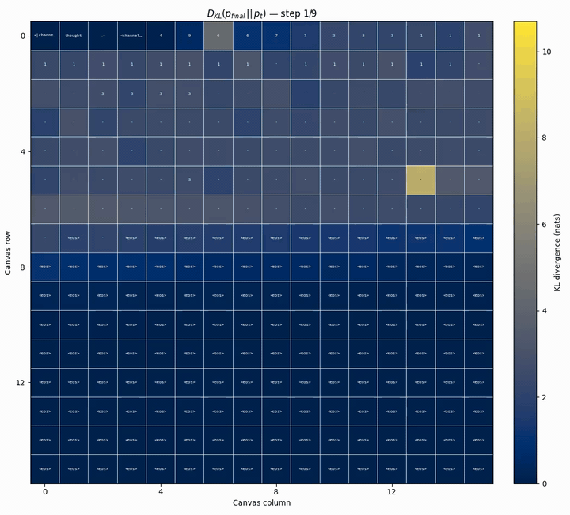
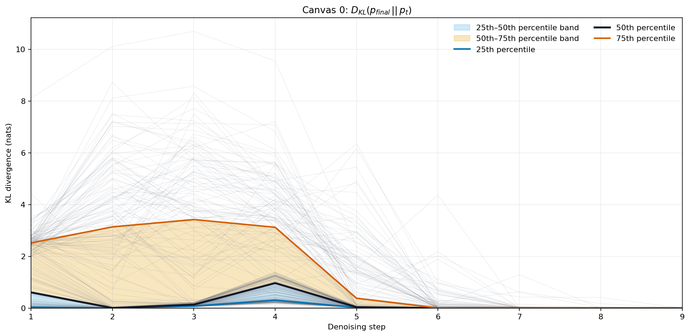
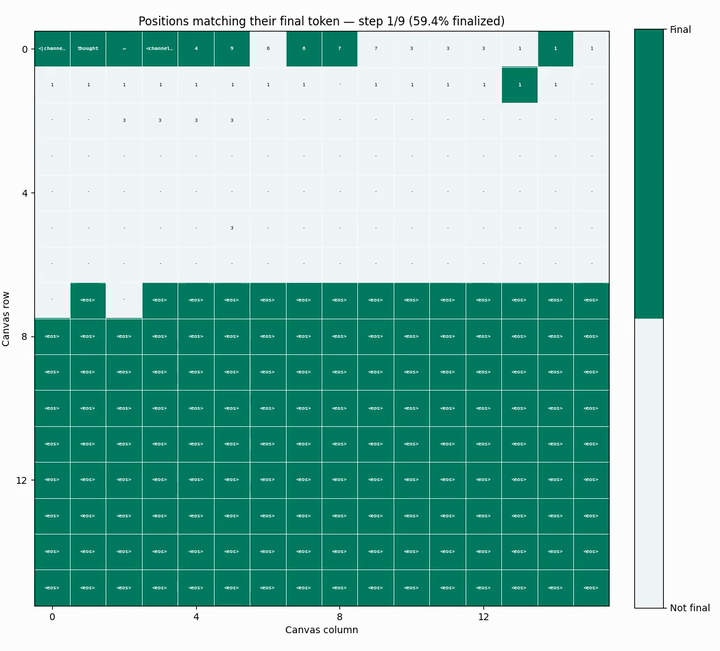
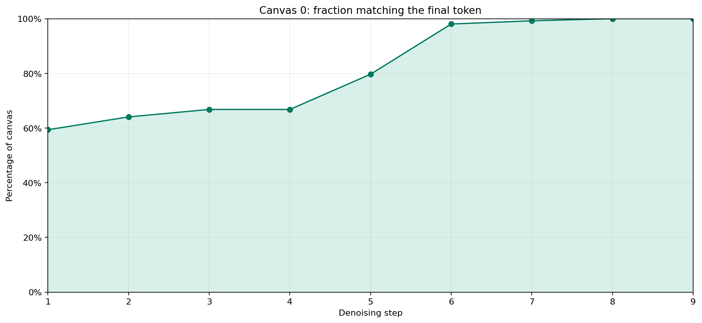
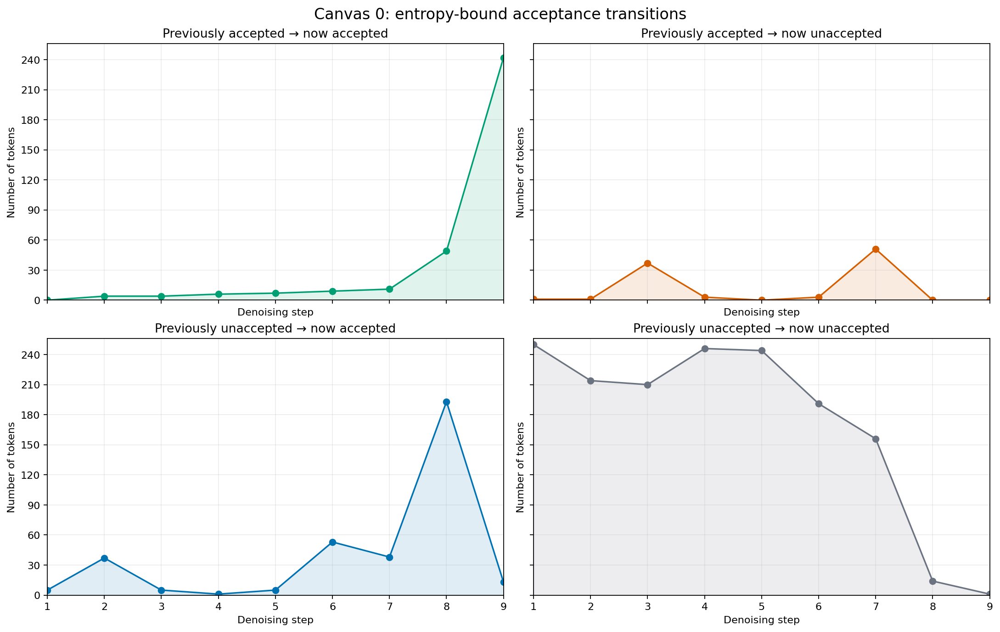
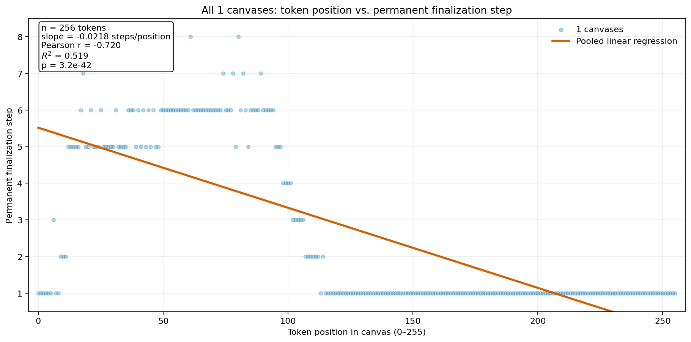

Prompt: 

```
Solve this Sudoku puzzle. 0 marks an empty cell. Reply with the completed 9x9 grid.
490673028
160805003
087001500
010400037
006908050
530160000
908014276
000709300
270580914
```

Model: 

```
495673128
162895743
387241569
819452637
726938451
534167892
958314276
641729385
273586914
```

---

## Plots

Tokens are laid out in the canvas in reading order (left to right, top to bottom).

### Entropy (canvas)

Each cell is colored proportionally to the entropy of that position's predicted token distribution, displaying the argmax token ([mp4](canvas_00_entropy_canvas.mp4)).





### Step-to-step KL (canvas)

KL divergence $D_{KL}(p_t \,\|\, p_{t-1})$ at each denoising step ([mp4](canvas_00_kl_previous_canvas.mp4)).



### KL to final (canvas)

KL divergence $D_{KL}(p_{final} \,\|\, p_t)$ at each denoising step ([mp4](canvas_00_kl_final_canvas.mp4)).





### Finalization (canvas)

A position is called "finalized" if its argmax token matches the final decoding step's argmax token at that position ([mp4](canvas_00_finalized_canvas.mp4)).



### Finalized fraction



### Acceptance transitions

A token is called "accepted" in this step if it is not renoised by the sampler, see the entropy-bound rule in the colab. At each step, a token may transition arbitrarily between the two states $\{\text{accepted}, \text{unaccepted}\}$.



### Position vs. finalization step

A scatterplot with data pooled across canvases to test: are earlier tokens finalized earlier?


